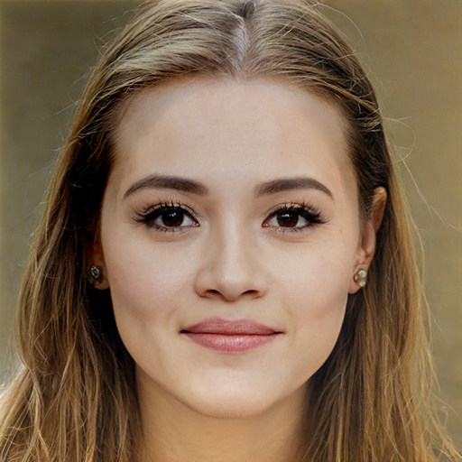
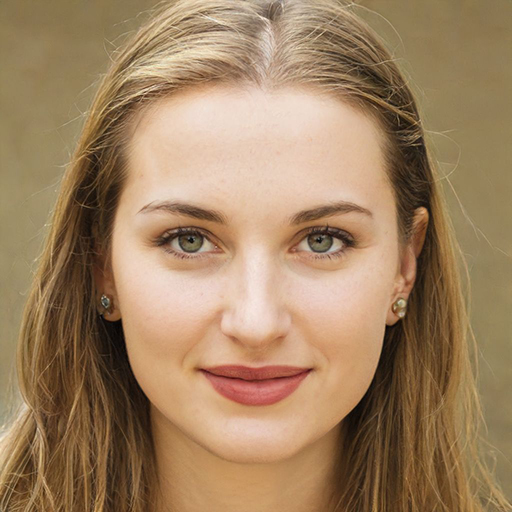
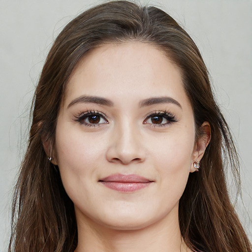

# Image Blending

# General Overview
You may have seen the ability to combine images in various photo editing applications and websites. Have you ever wondered how a computer can combine images? In this project, you will be able to combine any desired image with another image.

# Project Objective
The objective of this project is to employ the use of image pyramids in combining two different images based on a specific frame. To learn this project, it is necessary to understand the concept of Gaussian and Laplacian pyramids.

# Used Libraries
The main library used in this project is OpenCV, which is used for image processing and machine learning. The next library is Numpy, which allows various operations on numerical data stored in memory.

In one line of this program, a helper method from the scipy library is used to obtain better results.

# Project Functions Overview
- reduceImage
  
This function takes an image as input, applies a Gaussian filter to it, and finally halves the length and height of the image. To do this, we traverse the image and the step of each traversal is 2. Then, it returns the final image as output.

- expandImage

This function takes an image as input, creates a black image with twice the size of the input image, then previews it on the created image, and the step of each traversal is 2. It sets the input image equal to the created image, applies a Gaussian filter to it, and displays it as output.

- GaussianPyramid
  
This function takes an image as input, halves the length and height of the image using the reduceImage function, and stores each traversal in an element of an array. It repeats this process until the length and height of the image become less than 2, and finally returns an array of each level of the image. The purpose of this function is to create a Gaussian pyramid corresponding to the image.

- LaplacianPyramid

This function takes a Gaussian pyramid as input and tries to create a Laplacian pyramid of the image by traversing the input array. It obtains this by subtracting the current image difference in the loop from the expanded image of the next loop (this is done using the expandImage function). It then displays an array of the obtained Laplacian pyramid as output.

blendingPyramid
This function takes two Laplacian pyramids and a Gaussian pyramid of a mask as input, and in each traversal, it attempts to combine two images in the Laplacian pyramid with the weights present in the Gaussian pyramid of the mask. Finally, it returns an array of the blended images as output. The purpose of this function is to create a blend of images.

- reconstruct

This function takes a Laplacian pyramid from the previous function as input, performs a traversal on it, expands the image at each iteration, and adds it to the next layer.

# Algorithm Exploration
1. First, we read the two desired images and the mask.
2. Then, in the next step, we separate the input images into RGB channels and convert the mask to a grayscale channel.
3. Now it's time to have the kernel size for calculation. To calculate its size, we used a website that you can access <a href="http://demofox.org/gauss.html" target="_blank">here</a>
4. In this step, we calculate the Gaussian pyramid for each image in its three existing channels. We also need to calculate the Gaussian pyramid for our mask image.
5. Then, for the two input images, we calculate their Laplacian pyramid in all three RGB channels.
6. In this step, it is time to combine the obtained Laplacian pyramids from the previous step with the weights from the Gaussian pyramid of the mask (note that to normalize the intensity of the mask image, we divide it by 255).
7. In this step, we have the blended images in the Laplacian pyramid for all three channels, and we need to convert them into one image. We do this with the reconstruct function, which we explained in the Functions section.
8. Finally, we need to merge the images of each channel to give us a colored image. We save this image and then display it.

# INPUT : 

# OUTPUT : 

